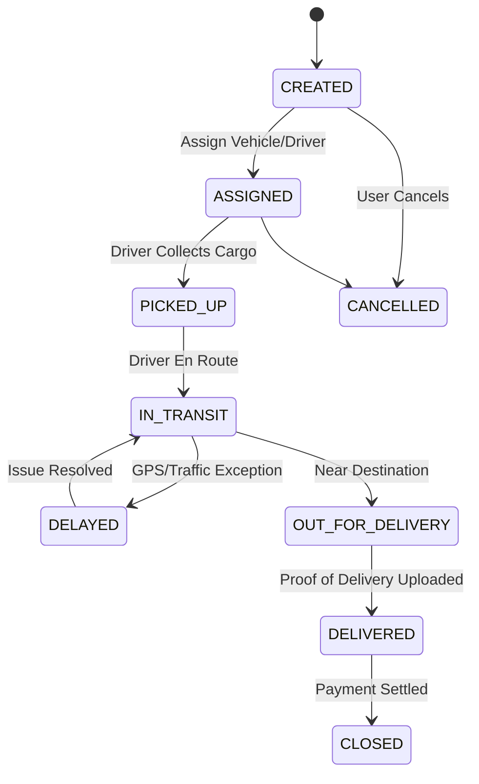
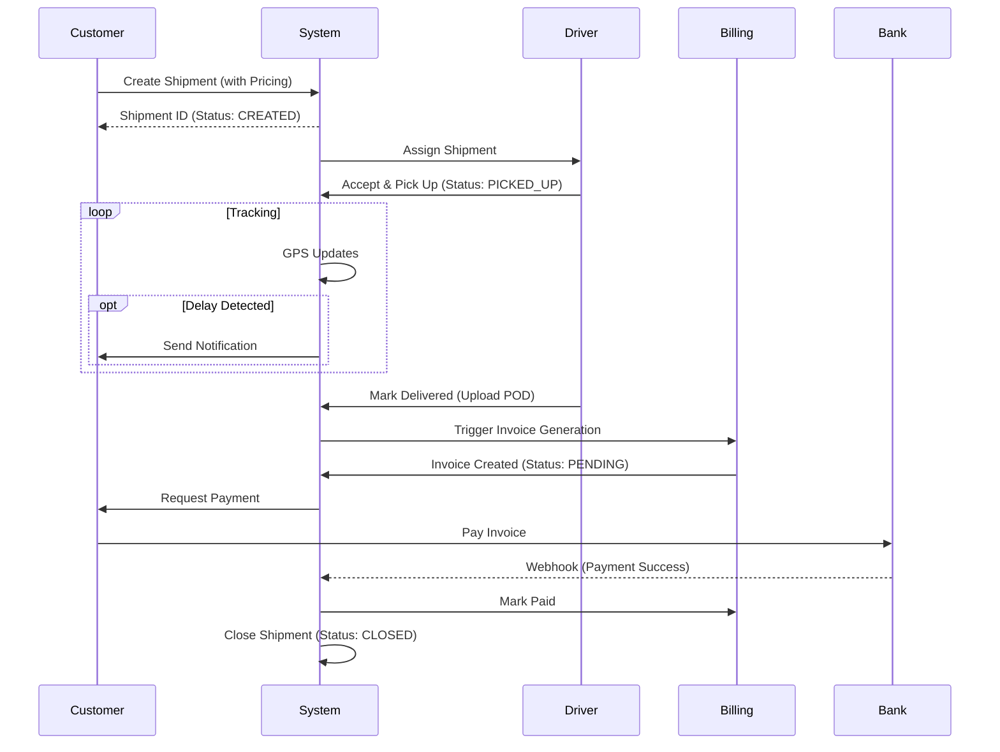

# System Workflows

## 1. Shipment Lifecycle (Event-Driven)



## 2. Order to Payment Flow



## 3. Real-time Auto-Assignment

```mermaid
flowchart TD
    A[New Shipment Created] --> B{Manager Assign?}
    B -- Yes --> C[Manual Selection]
    B -- No --> D[Auto-Assign Engine]
    D --> E[Search Nearby Drivers (Radius 10km)]
    E --> F[Filter: Vehicle Type & Capacity]
    F --> G[Sort by: Rating & Utilization]
    G --> H{Found Candidate?}
    H -- Yes --> I[Send Request to Driver]
    I --> J{Driver Accept?}
    J -- Yes --> K[Assign & Notify Customer]
    J -- No --> L[Try Next Candidate]
    H -- No --> M[Alert Manager (Manual Intervention)]
```
